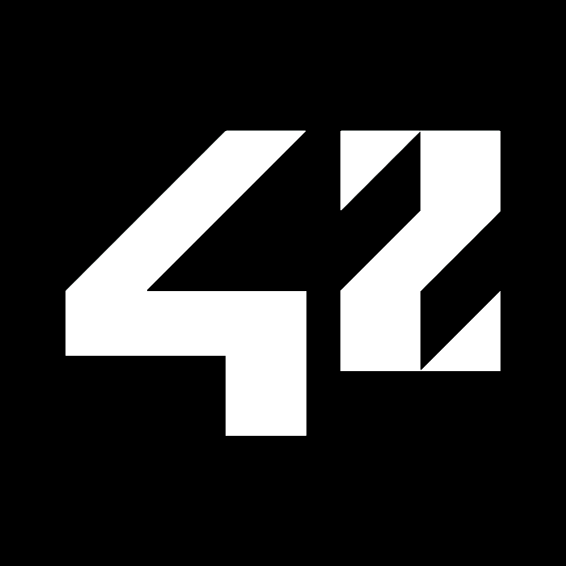

## Hola humano :)

Has descubierto el backend de mi personalidad. Mi vida como programador. 

## About me

Soy graduado en Periodismo, tengo un máster en Cultura Contemporánea y un posgrado en periodismo económico. Pese a contar con una prolongada carrera como periodista, un día descubrí que los ordenadores desataban mi curiosidad como pocas otras cosas lo hacían. Me convertí en estudiante de 42 Madrid en marzo de 2025, y desde entonces no he abandonado la nave espacial del código. Me interesa el open source como forma de conseguir la independencia tecnológica, y la programación ética que ponga al usuario en el foco frente a algoritmos malignos y dark patterns. Combino mi faceta periodística con la tecnológica en mi [newsletter](https://antinodo.substack.com). 

## Skills

Estoy estudiando *C* en 42 Madrid, y dentro de poco empezaré a aprender *Python*. En la carrera de Periodismo aprendí algo de HTML y CSS. 

## 📫 Contacto: 
Por mail - antinodo@proton.me
Por redes:

  

Estoy mudándome al fediverso. Puedes encontrarme en [Mastodon](https://masto.es/@vladberto). 

# return (bendiciones:)
