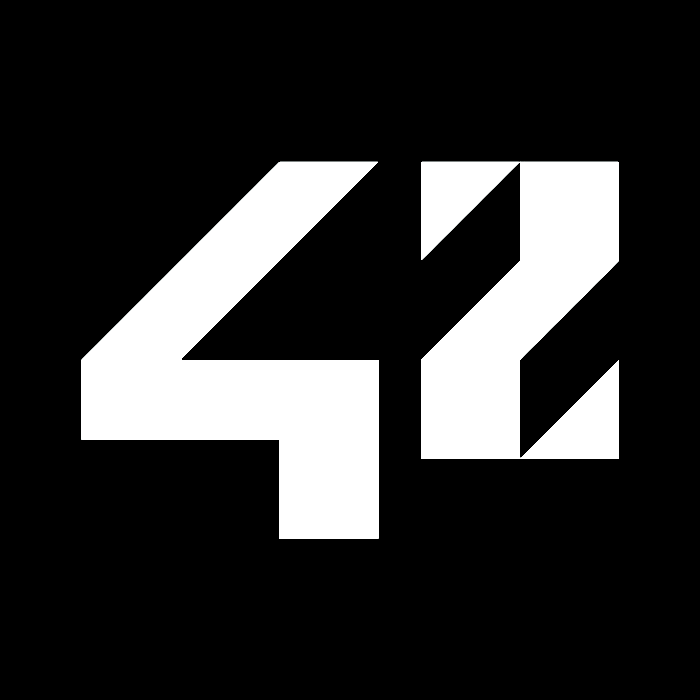

## _hola humano_

Has descubierto el backend de mi personalidad. Te presento: mi vida como programador. 

## 👽️ About me

Tras iniciar mi vida laboral como periodista, un día descubrí que los ordenadores desataban mi curiosidad como pocas otras cosas lo hacían. Me convertí en estudiante de 42 Madrid en marzo de 2025, y desde entonces no he abandonado la nave espacial del código. Me interesa el open source como forma de conseguir la independencia tecnológica, y la programación ética que pone el foco en el usuario frente a algoritmos malignos y dark patterns. Combino mi faceta periodística con la tecnológica en mi <a href="https://antinodo.substack.com" target="_blank" rel="noopener noreferrer">newsletter</a>.

   

## 📝 Skills

Estoy estudiando __C__ en 42 Madrid, y dentro de poco empezaré a aprender __Python__. En la carrera de Periodismo aprendí algo de __HTML__ y __CSS__. 

## 📫 Contacto  
Por mail:  
antinodo@proton.me  

Por redes:
  

Estoy mudándome al fediverso. Puedes encontrarme en [Mastodon](https://masto.es/@vladberto). 

## 🎨 Portfolio
Actualmente mi portfolio se compone de los proyectos que he realizado en 42:  

__Level__ __1__  

✅[libft](https://github.com/flypirate/libft) -> Mi propia librería de funciones en C.  

__Level__ __2__  

✅[ft_printf](https://github.com/flypirate/ft_printf) -> Reconstrucción de la función printf.  
✅[get next line](https://github.com/flypirate/getnextline) -> Programa para leer archivos.  

__Level__ __3__  

✅[pipex](https://github.com/flypirate/pipex) -> Programa que simula el comportamiento de un pipe (|).  
✅[push swap](https://github.com/flypirate/pushswap) -> Programa que ordena números con eficiencia O(n + k).  
✅[so_long](https://github.com/flypirate/so_long) -> Mi propio minijuego en 2D.  

//
También tengo un listado de ejercicios en C, característicos de 42, resueltos aquí: [ejercicios💯](https://github.com/flypirate/exercises)

# return (bendiciones:)✨
